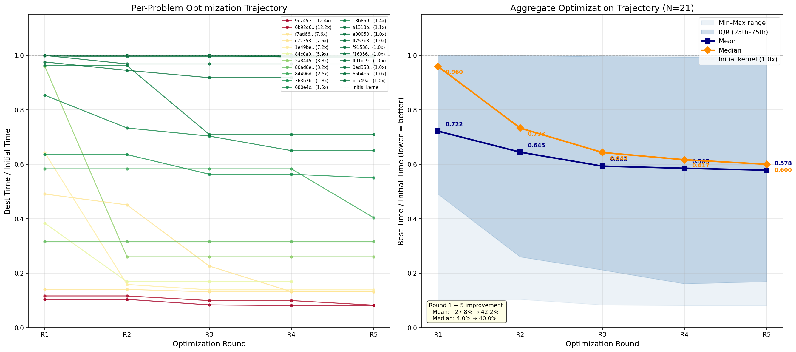

# KernelProblems v4 — Benchmark Review

## Per-problem comparison (all times in ms)

| problem | eager | triton | tri_opt | compile | comp_ma | **best** | **speedup** | key ops |
|---|---|---|---|---|---|---|---|---|
| `0ed358ecaed2` | 0.199 | 0.172 | 0.172 | 0.172 | 0.310 | **triton** | 1.2x | _to_copy, t |
| `18b859c50de2` | 1.486 | 1.500 | 1.066 | 1.051 | 2.382 | **compile** | 1.4x | _fused_rms_norm, _unsafe_view, add, clone... |
| `1e49beb8a123` | 0.306 | 0.424 | 0.100 | 0.166 | 0.992 | **triton_opt** | 3.0x | embedding, split_with_sizes, view |
| `2a844503364a` | 0.915 | 0.605 | 0.529 | 0.403 | 1.929 | **compile** | 2.3x | _fused_rms_norm, _unsafe_view, clone, reshape... |
| `363b7b58c971` | 0.945 | 0.772 | FAIL | 0.357 | 1.089 | **compile** | 2.7x | _fused_rms_norm, _fused_rms_norm_backward, _to_copy, _unsafe_view... |
| `4757b36375ae` | 0.128 | 0.096 | 0.095 | 0.160 | 0.259 | **triton_opt** | 1.3x | add, reshape |
| `4d1dc9709a0e` | 1.728 | 1.489 | 1.490 | 1.491 | 2.680 | **triton** | 1.2x | _to_copy, t |
| `65b4b565ed67` | 0.534 | 0.315 | 0.315 | 0.317 | 0.854 | **triton_opt** | 1.7x | mul, reshape, silu |
| `680e4c57cdc8` | 3.045 | 1.808 | 1.184 | 1.192 | 1.881 | **triton_opt** | 2.6x | _fused_rms_norm, _fused_rms_norm_backward, _to_copy, _unsafe_view... |
| `6b92d6e665ab` | 2.911 | 1.773 | 0.164 | 1.648 | 0.861 | **triton_opt** | 17.7x | _to_copy, index, mul, reshape... |
| `80ad8e737b06` | 23.109 | 90.312 | 29.984 | 2.985 | 4.899 | **compile** | 7.7x | _log_softmax, _log_softmax_backward_data, _to_copy, div... |
| `84496d824942` | 0.374 | 0.216 | FAIL | 0.201 | 0.503 | **compile** | 1.9x | _fused_rms_norm, _unsafe_view, clone, reshape... |
| `84c0a03c4374` | 0.786 | 2.192 | 0.361 | 0.290 | 0.946 | **compile** | 2.7x | _fused_rms_norm, _fused_rms_norm_backward, _to_copy, _unsafe_view... |
| `9c745ea697a7` | 0.922 | 4.328 | 0.362 | 0.357 | 1.076 | **compile** | 2.6x | _fused_rms_norm, _fused_rms_norm_backward, _to_copy, _unsafe_view... |
| `a1318bc813d2` | 1.561 | 0.785 | 0.773 | 0.769 | 0.497 | **compile_ma** | 3.1x | _to_copy, clone, mul, reshape... |
| `bca49a4df51c` | 0.160 | 0.071 | 0.068 | 0.160 | 0.214 | **triton_opt** | 2.4x | _to_copy, t |
| `c72358b8111e` | 1.479 | 2.119 | FAIL | 0.652 | 1.441 | **compile** | 2.3x | mul, reshape, silu, silu_backward... |
| `e00050757618` | 0.160 | 0.062 | 0.066 | 0.155 | 0.224 | **triton** | 2.6x | _to_copy, t |
| `f16356222984` | 0.199 | 0.172 | 0.172 | 0.172 | 0.308 | **triton** | 1.2x | _to_copy, t |
| `f7ad66842c19` | 0.659 | FAIL | 0.187 | 0.233 | 0.482 | **triton_opt** | 3.5x | _fused_rms_norm, _fused_rms_norm_backward, _to_copy, add... |
| `f91538eb2b54` | 0.246 | 0.095 | 0.095 | 0.168 | 0.291 | **triton_opt** | 2.6x | add, reshape |

## Summary

**Best backend distribution:** compile=8, compile_ma=1, triton=4, triton_opt=8

**Pass rates:** triton 20/21, triton_opt 18/21, compile 21/21, compile_ma 21/21

**Geomean speedup vs eager:**

| backend | geomean | range | n |
|---|---|---|---|
| triton | 1.12x | 0.21x – 2.58x | 20 |
| triton_opt | 2.08x | 0.77x – 17.70x | 18 |
| compile | 1.82x | 0.80x – 7.74x | 21 |
| compile_ma | 0.92x | 0.31x – 4.72x | 21 |

**Key findings:**

- **triton_opt** (NCU-optimized) delivers the highest geomean speedup (2.08x)
- **compile** wins on fused_rms_norm chains and loss computation (inductor cross-op fusion)
- **compile_max_autotune** wins on 1/21 (RoPE mul+clone), generally slower than default compile
- triton initial kernels have 1 correctness failure (`f7ad6`); triton_opt has 3 (`363b`, `84496`, `c723`)
- `6b92` (RoPE complex math) is the standout: triton_opt **17.7x** faster than eager, **10x** vs compile

---

## Kernel Agent NCU-Guided Optimization — Iteration Trajectory

The `triton_opt` kernels are produced by an iterative NCU-guided optimization loop. Each round the agent:
1. Profiles the current kernel with NVIDIA Nsight Compute (NCU)
2. Identifies bottlenecks (memory-bound, compute-bound, or underutilized)
3. Generates an improved Triton kernel targeting the bottleneck
4. Verifies correctness and benchmarks the new kernel

Each problem runs up to 5 rounds with early stopping on no-improvement.

### Per-problem trajectory (cumulative best time, ms)

| Problem | Initial | R1 | R2 | R3 | R4 | R5 | Final | vs Eager | vs Compile | vs Initial |
|---|---|---|---|---|---|---|---|---|---|---|
| `0ed358ecaed2` | 0.170 | 0.170 | 0.170 | — | — | — | 0.170 | 1.17x | 1.01x | 1.00x |
| `18b859c50de2` | 1.500 | 1.444 | 1.444 | 1.065 | 1.065 | 1.065 | 1.065 | 1.40x | 0.99x | 1.41x |
| `1e49beb8a123` | 0.358 | 0.230 | 0.057 | 0.050 | 0.050 | 0.050 | 0.050 | 6.15x | 3.34x | 7.22x |
| `2a844503364a` | 0.832 | 0.798 | 0.216 | 0.216 | 0.216 | 0.216 | 0.216 | 4.23x | 1.87x | 3.85x |
| `363b7b58c971` | 0.736 | 0.468 | 0.468 | 0.415 | 0.415 | 0.405 | 0.405 | 2.33x | 0.88x | 1.82x |
| `4757b36375ae` | 0.097 | 0.097 | 0.097 | 0.097 | 0.097 | 0.097 | 0.097 | 1.32x | 1.66x | 1.01x |
| `4d1dc9709a0e` | 1.488 | 1.487 | 1.487 | 1.487 | 1.487 | 1.487 | 1.487 | 1.16x | 1.00x | 1.00x |
| `65b4b565ed67` | 0.318 | 0.318 | 0.318 | 0.318 | 0.318 | 0.318 | 0.318 | 1.68x | 1.00x | 1.00x |
| `680e4c57cdc8` | 1.785 | 1.524 | 1.309 | 1.256 | 1.161 | 1.161 | 1.161 | 2.62x | 1.03x | 1.54x |
| `6b92d6e665ab` | 1.704 | 0.198 | 0.198 | 0.169 | 0.169 | 0.140 | 0.140 | 20.78x | 11.76x | 12.17x |
| `80ad8e737b06` | 90.695 | 28.649 | 28.649 | 28.649 | 28.649 | 28.649 | 28.649 | 0.81x | 0.10x | 3.17x |
| `84496d824942` | 0.187 | 0.109 | 0.109 | 0.109 | 0.109 | 0.075 | 0.075 | 4.97x | 2.67x | 2.48x |
| `84c0a03c4374` | 2.223 | 0.853 | 0.375 | 0.375 | 0.375 | — | 0.375 | 2.10x | 0.77x | 5.93x |
| `9c745ea697a7` | 4.327 | 0.449 | 0.449 | 0.360 | 0.350 | 0.350 | 0.350 | 2.63x | 1.02x | 12.36x |
| `a1318bc813d2` | 0.784 | 0.765 | 0.741 | 0.720 | 0.720 | — | 0.720 | 2.17x | 1.07x | 1.09x |
| `bca49a4df51c` | 0.017 | 0.018 | 0.018 | 0.018 | 0.018 | 0.018 | 0.018 | 8.80x | 8.80x | 0.95x |
| `c72358b8111e` | 2.893 | 1.420 | 1.304 | 0.654 | 0.382 | 0.382 | 0.382 | 3.88x | 1.71x | 7.58x |
| `e00050757618` | 0.052 | 0.052 | 0.050 | 0.050 | 0.050 | 0.050 | 0.050 | 3.17x | 3.08x | 1.03x |
| `f16356222984` | 0.170 | 0.170 | 0.170 | 0.170 | 0.170 | 0.170 | 0.170 | 1.17x | 1.01x | 1.00x |
| `f7ad66842c19` | 1.245 | 0.175 | 0.175 | 0.164 | 0.164 | 0.164 | 0.164 | 4.03x | 1.42x | 7.61x |
| `f91538eb2b54` | 0.097 | 0.097 | 0.097 | 0.097 | 0.097 | 0.097 | 0.097 | 2.55x | 1.73x | 1.01x |

### Aggregate trajectory

| Metric | R1 | R2 | R3 | R4 | R5 |
|---|---|---|---|---|---|
| Mean (best / initial) | 0.722 | 0.645 | 0.593 | 0.585 | 0.578 |
| Median (best / initial) | 0.960 | 0.733 | 0.704 | 0.650 | 0.600 |
| Cumulative improvement (mean) | −27.5% | −35.3% | −40.4% | −41.2% | −42.2% |

### Top 5 improvements (vs initial kernel)

| Rank | Problem | Speedup | Initial → Final | Trajectory |
|---|---|---|---|---|
| 1 | `9c745ea697a7` | 12.36x | 4.327 → 0.350 ms | 0.449 → 0.449 → 0.360 → 0.350 → 0.350 |
| 2 | `6b92d6e665ab` | 12.17x | 1.704 → 0.140 ms | 0.198 → 0.198 → 0.169 → 0.169 → 0.140 |
| 3 | `f7ad66842c19` | 7.61x | 1.245 → 0.164 ms | 0.175 → 0.175 → 0.164 → 0.164 → 0.164 |
| 4 | `c72358b8111e` | 7.58x | 2.893 → 0.382 ms | 1.420 → 1.304 → 0.654 → 0.382 → 0.382 |
| 5 | `1e49beb8a123` | 7.22x | 0.358 → 0.050 ms | 0.230 → 0.057 → 0.050 → 0.050 → 0.050 |

### Observations

- **Most gains in rounds 1–2**: mean drops from 1.0 → 0.722 (R1) → 0.645 (R2); rounds 3–5 add only ~7% more
- **Median lags mean in R1** (0.960 vs 0.722): a few problems get dramatic early wins while most see modest R1 improvement; the median catches up by R3–R5
- **8 problems plateau at <1.05x improvement**: these are either sub-0.1ms (launch-overhead-dominated) or already well-optimized initial kernels
- **1 regression** (`bca49a4df51c`): 0.017 → 0.018 ms (5.6% slower); at 17 µs the kernel is launch-overhead-dominated
- **`80ad8e737b06`** is the outlier: 3.17x vs initial but still 0.81x vs eager (90ms initial kernel was very poor; agent improved it but couldn't match torch.compile's cross-op fusion)