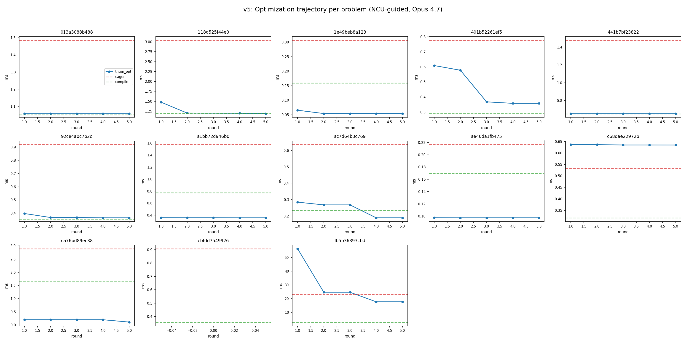

# KernelProblems v5 — Benchmark Review

## Per-problem comparison (all times in ms)

| problem | eager | triton | tri_opt | compile | comp_ma | **best** | **speedup** | key ops |
|---|---|---|---|---|---|---|---|---|
| `013a3088b488` | 1.486 | 1.061 | 1.057 | 1.051 | 2.380 | **compile** | 1.4x | _fused_rms_norm, add, split_with_sizes |
| `118d525f44e0` | 3.044 | 1.472 | 1.188 | 1.191 | 1.879 | **triton_opt** | 2.6x | _fused_rms_norm, _fused_rms_norm_backward, _to_copy, add... |
| `1e49beb8a123` | 0.307 | 0.110 | 0.111 | 0.159 | 0.991 | **triton** | 2.8x | embedding, split_with_sizes |
| `401b52261ef5` | 0.779 | 0.598 | 0.391 | 0.290 | 0.942 | **compile** | 2.7x | _fused_rms_norm, _fused_rms_norm_backward, _to_copy, add |
| `441b7bf23822` | 1.478 | 0.656 | 0.656 | 0.652 | 1.442 | **compile** | 2.3x | mul, silu, silu_backward |
| `92ce4a0c7b2c` | 0.920 | 1.157 | 0.353 | 0.356 | 1.084 | **triton_opt** | 2.6x | _fused_rms_norm, _fused_rms_norm_backward, _to_copy, add |
| `a1bb72d946b0` | 1.578 | 0.687 | 0.357 | 0.774 | 0.491 | **triton_opt** | 4.4x | _to_copy, mul, view_as_complex, view_as_real |
| `ac7d64b3c769` | 0.637 | 1.076 | 0.226 | 0.233 | 0.481 | **triton_opt** | 2.8x | _fused_rms_norm, _fused_rms_norm_backward, _to_copy, add... |
| `ae46da1fb475` | 0.217 | 0.130 | 0.104 | 0.170 | 0.291 | **triton_opt** | 2.1x | add |
| `c68dae22972b` | 0.534 | 0.316 | 0.318 | 0.317 | 0.852 | **triton** | 1.7x | mul, silu |
| `ca76bd89ec38` | 2.894 | 0.489 | 0.144 | 1.644 | 0.860 | **triton_opt** | 20.1x | _to_copy, index, mul, view_as_complex... |
| `cbfdd7549926` | 0.907 | 0.586 | - | 0.358 | 1.077 | **compile** | 2.5x | _fused_rms_norm, _fused_rms_norm_backward, _to_copy, add |
| `fb5b36393cbd` | 23.107 | 64.652 | 17.618 | 2.988 | 4.897 | **compile** | 7.7x | _log_softmax, _log_softmax_backward_data, _to_copy, div... |

## Summary

**Best backend distribution:** compile=5, triton=2, triton_opt=6

**Pass rates:** triton 13/13, triton_opt 12/12, compile 13/13, compile_ma 13/13

**Geomean speedup vs eager:**

| backend | geomean | range | n |
|---|---|---|---|
| triton | 1.52x | 0.36x – 5.92x | 13 |
| triton_opt | 2.67x | 1.31x – 20.07x | 12 |
| compile | 2.28x | 1.28x – 7.73x | 13 |
| compile_ma | 1.15x | 0.31x – 4.72x | 13 |

## Optimization trajectory

Left: per-problem optimization curves (best time / initial time, lower = better). Right: aggregate mean/median with IQR across 13 problems. Mean improves from 0.755 → 0.594 (40.6% reduction), median from 0.867 → 0.586 (41.4%).

**Key findings:**

- **triton_opt** (NCU-optimized, Opus 4.7) delivers the highest geomean speedup (2.67x)
- **compile** wins on fused_rms_norm fwd+bwd chains, silu_backward, and loss computation
- `ca76bd89ec38` (RoPE complex math) is the standout: triton_opt **20.1x** faster than eager, **11.4x** vs compile
- All 13 triton kernels pass correctness; 12/12 triton_opt pass (1 optimization failed)
- v5 is cleaner than v4: 13 problems (was 21) after `remove_inverse_transpose_pass` and `min_compute_ops=2`