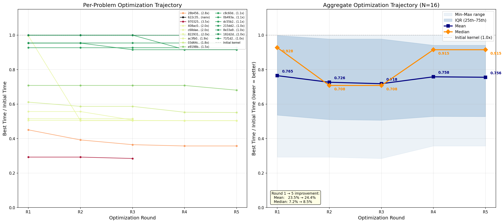

# KernelProblems v6 — Benchmark Review

## Per-problem comparison (all times in ms)

| problem | fwd/bwd | inst | eager | triton | tri_opt | compile | comp_ma | **best** | **speedup** | key ops |
|---|---|---|---|---|---|---|---|---|---|---|
| `03d64c25b654` | BWD | x32 | 0.702 | 0.098 | 0.085 | 0.414 | 0.285 | **triton_opt** | 8.3x | _to_copy, mul, view_as_complex, view_as_real |
| `0b493aad68f0` | BWD | x1 | 3.034 | 1.583 | 1.450 | 1.192 | 1.505 | **compile** | 2.5x | _fused_rms_norm, _fused_rms_norm_backward, _to_copy, add... |
| `182d2dcd0652` | BWD | x32 | 1.478 | 0.653 | 0.653 | 0.652 | 1.441 | **compile** | 2.3x | mul, silu, silu_backward |
| `1e49beb8a123` | FWD | x1 | 0.309 | 0.425 | 0.102 | 0.165 | 0.995 | **triton_opt** | 3.0x | embedding, split_with_sizes |
| `215dd2e6a519` | FWD | x32 | 0.367 | 0.119 | 0.119 | 0.184 | 0.502 | **triton_opt** | 3.1x | _fused_rms_norm |
| `28b45679fca1` | BWD | x1 | 0.501 | 0.672 | 0.208 | 0.233 | 0.447 | **triton_opt** | 2.4x | _fused_rms_norm, _fused_rms_norm_backward, _to_copy, add |
| `408ac0979ac5` | BWD | x31 | 0.751 | 0.766 | 0.383 | 0.358 | 0.734 | **compile** | 2.1x | _fused_rms_norm, _fused_rms_norm_backward, _to_copy, add |
| `622c35f5d1c6` | BWD | x1 | 12.150 | 2.911 | - | 3.001 | 6.797 | **triton** | 4.2x | _log_softmax_backward_data, _to_copy, div, nll_loss_backward... |
| `71f1d2c9f38b` | FWD | x1 | 10.968 | 1.841 | 1.840 | 1.359 | 3.137 | **compile** | 8.1x | _log_softmax, _to_copy, div, nll_loss_forward |
| `822931829090` | BWD | x31 | 0.775 | 0.729 | 0.361 | 0.355 | 0.728 | **compile** | 2.2x | _fused_rms_norm, _fused_rms_norm_backward, _to_copy, add |
| `8e33a91b7364` | FWD | x1 | 1.488 | 1.054 | 1.053 | 1.050 | 2.380 | **compile** | 1.4x | _fused_rms_norm, add, split_with_sizes |
| `97032595d968` | BWD | x32 | 1.373 | 0.421 | 0.144 | 0.920 | 0.496 | **triton_opt** | 9.5x | _to_copy, index, mul, view_as_complex... |
| `ac3fb0b7281f` | FWD | x32 | 0.338 | 0.171 | 0.100 | 0.178 | 0.500 | **triton_opt** | 3.4x | _fused_rms_norm |
| `c68dae22972b` | FWD | x32 | 0.534 | 0.317 | 0.318 | 0.317 | 0.853 | **triton** | 1.7x | mul, silu |
| `c8c60d8f7015` | FWD | x32 | 1.393 | 0.170 | 0.167 | 0.927 | 0.495 | **triton_opt** | 8.3x | _to_copy, index, mul, view_as_complex... |
| `dc55b25cdcb2` | BWD | x32 | 0.705 | 0.120 | 0.116 | 0.418 | 0.396 | **triton_opt** | 6.1x | _to_copy, mul, view_as_complex, view_as_real |
| `e9198b707240` | BWD | x1 | 0.621 | 0.472 | 0.357 | 0.290 | 0.589 | **compile** | 2.1x | _fused_rms_norm, _fused_rms_norm_backward, _to_copy, add |

## Summary

**Best backend distribution:** compile=7, triton=2, triton_opt=8

**Pass rates:** triton 17/17, triton_opt 16/16, compile 17/17, compile_ma 17/17

**Geomean speedup vs eager:**

| backend | geomean | range | n |
|---|---|---|---|
| triton | 2.29x | 0.73x – 8.17x | 17 |
| triton_opt | 3.24x | 1.41x – 9.54x | 16 |
| compile | 2.15x | 1.42x – 8.07x | 17 |
| compile_ma | 1.23x | 0.31x – 3.50x | 17 |

## E2E performance (fake backend, compute-only)

| run | step 10 MFU | step 20 MFU | tps |
|---|---|---|---|
| baseline (regional, no fusion) | 42.74% | 42.46% | 7,299 / 7,251 |
| **fused v6** (compile=7, triton=2, triton_opt=8) | **44.38%** | **44.17%** | **7,578 / 7,544** |
| full inductor (upper bound) | 46.78% | 45.60% | 7,988 / 7,788 |

**MFU gain: +1.64 pp (+3.8% relative)**. Closes 40% of the gap between regional baseline and full inductor.

## Optimization trajectory

Left: per-problem optimization curves (best time / initial time, lower = better). Right: aggregate mean/median with IQR. Generated by `plot_perf_trajectory.py`.

**Key findings:**

- Forward/backward split resolved 160 topological conflicts → **197 replacements** (was 37)
- **triton_opt** delivers highest geomean speedup; RoPE kernels are the standout wins (up to 19.9x vs eager)
- **compile** (via `compile_fx_inner`) wins on rms_norm backward + residual add chains
- Standalone `_fused_rms_norm` regions (x32 fwd, x32 bwd) now accepted via `_STANDALONE_WORTH_FUSING`
- All outputs are contiguous (trailing transpose stripped at extraction) — zero stride-fix copies
- Kernels generated by Claude Opus 4.7, NCU-optimized with 5 rounds