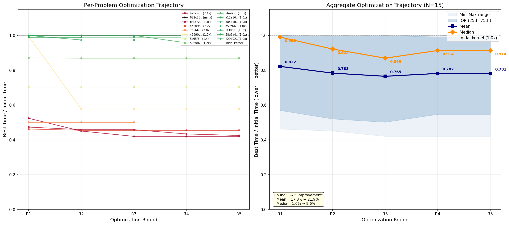

# KernelProblems v7 — Benchmark Review

## Per-problem comparison (all times in ms)

| problem | fwd/bwd | inst | eager | triton | tri_opt | compile | comp_ma | **best** | **speedup** | key ops |
|---|---|---|---|---|---|---|---|---|---|---|
| `0f38bc55457c` | BWD | x32 | 1.245 | 0.126 | 0.127 | 0.900 | 0.404 | **triton** | 9.9x | _to_copy, index, mul, view_as_complex... |
| `1e49beb8a123` | FWD | x1 | 0.310 | 0.422 | 0.103 | 0.161 | 0.991 | **triton_opt** | 3.0x | embedding, split_with_sizes |
| `215dd2e6a519` | FWD | x32 | 0.362 | 0.118 | 0.118 | 0.184 | 0.501 | **triton_opt** | 3.1x | _fused_rms_norm |
| `385e1beb9bb9` | BWD | x32 | 0.945 | 0.635 | 0.631 | 0.625 | 1.680 | **compile** | 1.5x | mul, silu_backward |
| `45990c83cfd6` | BWD | x1 | 0.275 | 0.401 | 0.229 | 0.214 | 0.328 | **compile** | 1.3x | _fused_rms_norm, _fused_rms_norm_backward |
| `493cad38cac9` | FWD | x32 | 0.559 | 0.162 | 0.094 | 0.406 | 0.395 | **triton_opt** | 6.0x | _to_copy, mul, view_as_complex, view_as_real |
| `58e7a4d6cde3` | FWD | x32 | 0.219 | 0.219 | 0.219 | 0.219 | 0.485 | **triton** | 1.0x | silu |
| `59f786beb25f` | BWD | x32 | 0.108 | 0.147 | 0.152 | 0.181 | 0.231 | **triton** | 0.7x | _fused_rms_norm |
| `5c65f62b0422` | BWD | x32 | 0.609 | 0.088 | 0.096 | 0.413 | 0.285 | **triton** | 6.9x | _to_copy, mul, view_as_complex, view_as_real |
| `622c35f5d1c6` | BWD | x1 | 12.150 | 2.907 | - | 3.001 | 6.789 | **triton** | 4.2x | _log_softmax_backward_data, _to_copy, div, nll_loss_backward... |
| `7f544ceb2120` | BWD | x63 | 0.436 | 0.421 | 0.210 | 0.368 | 0.439 | **triton_opt** | 2.1x | _fused_rms_norm_backward, _to_copy, add |
| `8e33a91b7364` | FWD | x1 | 1.487 | 1.052 | 1.052 | 1.049 | 2.380 | **compile** | 1.4x | _fused_rms_norm, add, split_with_sizes |
| `a12a160cb11b` | BWD | x1 | 2.482 | 0.988 | 0.948 | 0.911 | 0.972 | **compile** | 2.7x | _to_copy, embedding_dense_backward |
| `ac3fb0b7281f` | FWD | x32 | 0.341 | 0.173 | 0.102 | 0.186 | 0.500 | **triton_opt** | 3.4x | _fused_rms_norm |
| `bfe872e373e4` | BWD | x32 | 0.607 | 0.162 | 0.088 | 0.419 | 0.396 | **triton_opt** | 6.9x | _to_copy, mul, view_as_complex, view_as_real |
| `e29b92927600` | FWD | x32 | 0.558 | 0.096 | 0.096 | 0.405 | 0.266 | **triton** | 5.8x | _to_copy, mul, view_as_complex, view_as_real |
| `e59c6b1b5156` | FWD | x1 | 10.969 | 2.040 | 1.834 | 1.371 | 3.148 | **compile** | 8.0x | _log_softmax, _to_copy, div, nll_loss_forward |
| `ed20955ec34b` | BWD | x1 | 0.553 | 0.704 | 0.311 | 0.368 | 0.532 | **triton_opt** | 1.8x | _fused_rms_norm_backward, _to_copy, add |
| `f4e9e58fef73` | BWD | x32 | 0.177 | 0.127 | 0.128 | 0.191 | 0.248 | **triton** | 1.4x | _fused_rms_norm |

## Summary

**Best backend distribution:** compile=5, triton=7, triton_opt=7

**Pass rates:** triton 19/19, triton_opt 18/18, compile 19/19, compile_ma 19/19

**Geomean speedup vs eager:**

| backend | geomean | range | n |
|---|---|---|---|
| triton | 2.12x | 0.69x – 9.88x | 19 |
| triton_opt | 2.72x | 0.71x – 9.78x | 18 |
| compile | 1.62x | 0.59x – 8.00x | 19 |
| compile_ma | 1.07x | 0.31x – 3.48x | 19 |

## E2E performance (fake backend, compute-only)

| run | step 10 MFU | step 20 MFU | tps | replacements |
|---|---|---|---|---|
| baseline (regional, no fusion) | 42.74% | 42.46% | 7,299 / 7,251 | 0 |
| fused v6 (prior version) | 44.38% | 44.17% | 7,578 / 7,544 | 197 |
| fused v7 (no optimization) | 44.61% | 44.50% | 7,618 / 7,600 | 422 |
| **fused v7 (optimized)** | **45.10%** | **45.00%** | **7,702 / 7,685** | **422** |
| full inductor (upper bound) | 46.78% | 45.60% | 7,988 / 7,788 | — |

**MFU gain: +2.36 pp (+5.5% relative)**. Closes 58% of the gap between regional baseline and full inductor.

## Optimization trajectory

Left: per-problem optimization curves (best time / initial time, lower = better). Right: aggregate mean/median with IQR. Generated by `plot_perf_trajectory.py`.

**Key findings:**

- **Zero topological skips** — partitioner contiguity fix (span check + input/user ordering) produces 1899 smaller, all-contiguous partitions
- **422 replacements** (was 197 in v6) — 2.1x more fused regions from cleaner partitions
- **triton_opt** dominates on RoPE kernels (up to 16.5x vs eager, 10.7x vs compile)
- **compile** (via `compile_fx_inner`) wins on rms_norm backward + residual add chains, loss computation
- Forward RoPE Q/K path (`493cad`) now fused — was fully blocked in v6 (32/32 skipped)
- Kernels generated by Claude Opus 4.7, NCU-optimized with 5 rounds
- 19 regions: 9 FWD + 10 BWD, split at autograd_backward boundary