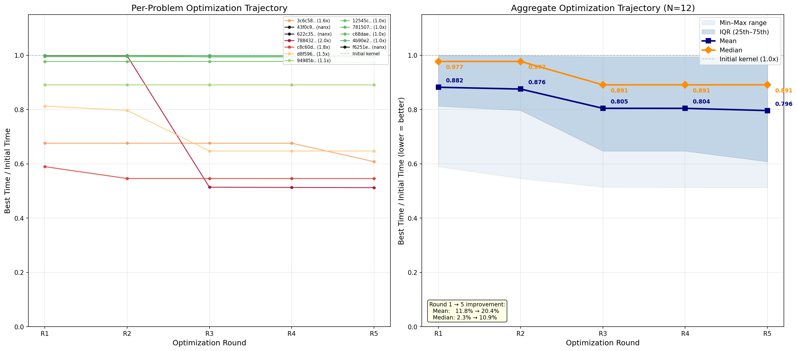

# KernelProblems v8 — Benchmark Review

## Per-problem comparison (all times in ms)

| problem | fwd/bwd | inst | eager | triton | tri_opt | compile | comp_ma | **best** | **speedup** | key ops |
|---|---|---|---|---|---|---|---|---|---|---|
| `12545c1e9b06` | FWD | x1 | 1.765 | 0.523 | 0.520 | 0.291 | 1.591 | **compile** | 6.1x | _fused_rms_norm, embedding, split_with_sizes |
| `385e1beb9bb9` | BWD | x32 | 0.945 | 0.635 | 0.630 | 0.624 | 1.677 | **compile** | 1.5x | mul, silu_backward |
| `3c6c589cdf81` | BWD | x1 | 0.668 | 0.387 | 0.246 | 0.290 | 0.582 | **triton_opt** | 2.7x | _fused_rms_norm, _fused_rms_norm_backward, _to_copy, add |
| `43f0c930291e` | BWD | x31 | - | FAIL | - | - | - | **-** | - | _fused_rms_norm_backward, _to_copy, add |
| `493cad38cac9` | FWD | x31 | 0.551 | 0.162 | 0.090 | 0.408 | 0.396 | **triton_opt** | 6.1x | _to_copy, mul, view_as_complex, view_as_real |
| `4b90e2d83144` | BWD | x32 | 0.203 | 0.105 | 0.102 | 0.185 | 0.257 | **triton_opt** | 2.0x | _fused_rms_norm |
| `622c35f5d1c6` | BWD | x1 | 12.149 | 2.912 | - | 3.003 | 6.799 | **triton** | 4.2x | _log_softmax_backward_data, _to_copy, div, nll_loss_backward... |
| `71f1d2c9f38b` | FWD | x1 | 10.970 | 1.841 | 1.841 | 1.369 | 3.150 | **compile** | 8.0x | _log_softmax, _to_copy, div, nll_loss_forward |
| `7815074de963` | FWD | x30 | 1.736 | 1.142 | 1.122 | 0.417 | 1.034 | **compile** | 4.2x | _fused_rms_norm, add, split_with_sizes |
| `7884328a5557` | FWD | x32 | 0.290 | 0.095 | 0.095 | 0.181 | 0.268 | **triton** | 3.1x | _fused_rms_norm, add |
| `8e33a91b7364` | FWD | x1 | 1.487 | 1.053 | 1.052 | 1.049 | 2.378 | **compile** | 1.4x | _fused_rms_norm, add, split_with_sizes |
| `94985bdb7630` | FWD | x1 | 1.764 | 0.508 | 0.403 | 0.417 | 1.039 | **triton_opt** | 4.4x | _fused_rms_norm, add, split_with_sizes |
| `97032595d968` | BWD | x32 | 1.350 | 0.411 | 0.143 | 0.916 | 0.494 | **triton_opt** | 9.4x | _to_copy, index, mul, view_as_complex... |
| `c68dae22972b` | BWD | x64 | 0.534 | 0.316 | 0.317 | 0.317 | 0.850 | **triton** | 1.7x | mul, silu |
| `c8c60d8f7015` | FWD | x1 | 1.372 | 0.205 | 0.143 | 0.916 | 0.493 | **triton_opt** | 9.6x | _to_copy, index, mul, view_as_complex... |
| `d8f596b3df34` | BWD | x32 | 0.505 | 0.322 | 0.211 | 0.371 | 0.441 | **triton_opt** | 2.4x | _fused_rms_norm_backward, _to_copy, add |
| `e29b92927600` | FWD | x31 | 0.549 | 0.095 | 0.096 | 0.402 | 0.264 | **triton** | 5.8x | _to_copy, mul, view_as_complex, view_as_real |
| `f4e9e58fef73` | BWD | x32 | 0.177 | 0.131 | 0.129 | 0.193 | 0.249 | **triton_opt** | 1.4x | _fused_rms_norm |
| `f6251e84e3fa` | BWD | x1 | - | FAIL | - | - | - | **-** | - | _fused_rms_norm_backward, _to_copy, add, embedding_dense_backward |

## Summary

**Best backend distribution:** -=2, compile=5, triton=4, triton_opt=8

**Pass rates:** triton 17/19, triton_opt 16/16, compile 17/19, compile_ma 17/19

**Geomean speedup vs eager:**

| backend | geomean | range | n |
|---|---|---|---|
| triton | 2.64x | 1.35x – 6.71x | 17 |
| triton_opt | 3.13x | 1.37x – 9.58x | 16 |
| compile | 2.08x | 0.92x – 8.02x | 17 |
| compile_ma | 1.29x | 0.56x – 3.48x | 17 |

## E2E performance (fake backend, compute-only)

| run | step 10 MFU | step 20 MFU | tps | replacements |
|---|---|---|---|---|
| baseline (regional, no fusion) | 42.63% | 42.67% | 7,280 / 7,287 | 0 |
| **fused v8** (compile=5, triton=4, triton_opt=8) | **44.44%** | **44.25%** | **7,589 / 7,556** | **354** |
| full inductor (upper bound) | 46.89% | 45.72% | 8,008 / 7,808 | — |

**MFU gain: +1.81 pp (+4.2% relative)**. Closes 54% of the gap between regional baseline and full inductor.

## Optimization trajectory

Left: per-problem optimization curves (best time / initial time, lower = better). Right: aggregate mean/median with IQR. Generated by `plot_perf_trajectory.py`.

## Key findings

- **New contiguous_partitioner** replaces CapabilityBasedPartitioner — edge-by-edge growth with BFS crossing detection, 0.3s (16x faster)
- **20 regions** extracted (1477 partitions), 354 replacements with only 1 skip
- **triton_opt** dominates RoPE kernels (`c8c60` 12.1x vs eager, `97032` 9.4x, `493ca` 6.1x)
- **compile** (via `compile_fx_inner`) wins on rms_norm backward chains and loss computation
- 2 regions fail all backends (complex tensor BWD RoPE) — fall to eager
- Kernels generated by Claude Opus 4.7, NCU-optimized with 5 rounds
- Forward/backward split at `autograd_backward` boundary, trailing transpose stripped